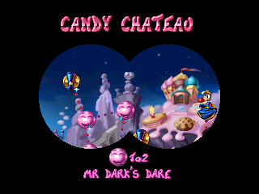
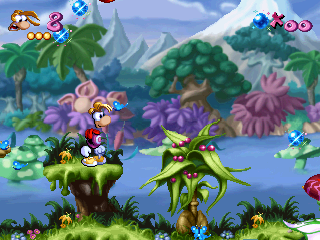
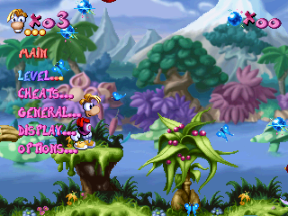
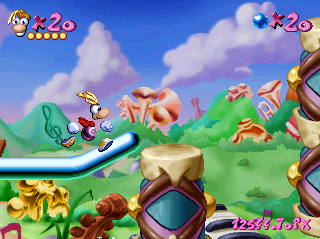
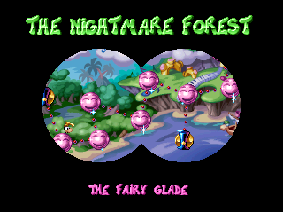
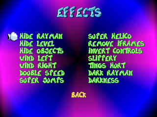
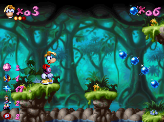
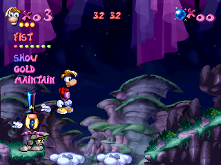
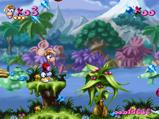

# Rayman PS1 Modding
This project provides an easy way for modding the PS1 version of Rayman 1 using the [PSX Modding Toolchain](https://github.com/mateusfavarin/psx-modding-toolchain). It includes symbols exported from the game, allowing mods to directly access its functions and data. Currently the NTSC and PAL versions are supported by this project, though not all mods have been updated to work for the PAL version.

Included in here are several mods as well as an [example](mods/HelloWorld). Feel free to submit your own mods through pull requests!

## Mods
Below is a list of every mod available in this repo, in alphabetical order. In order to apply a mod without using the toolchain you can download the provided `xdelta` patch file and [apply it](https://kotcrab.github.io/xdelta-wasm) to the game's first .bin disc file. Note that when using xdelta files you can only apply one mod at a time. 

| Image | Name | Author | Description | Status | Download |
| ----- | ---- | ------ | ----------- | ------ | -------- |
| | [Ability Shop](mods/AbilityShop) | [fuerchter](https://github.com/fuerchter) | Provides an all new way to play the game where you now have a goal to collect a certain number of items, an ability shop for unlocking powers and all levels unlocked from the start.  For more info, see the [readme](mods/AbilityShop/README.md). | Crashes on latest version | |
|  | [Blind Race](mods/BlindRace) | [RayCarrot](https://github.com/RayCarrot) | Created for the *Rayman 1 Blind Community Race* in 2023. Adds a cage counter to the worldmap and allows accessing Mr Dark's Dare without collecting all cages.  For more info, see the [readme](mods/BlindRace/readme.md). | Complete | [NTSC](mods/BlindRace/patches/ntsc-u.xdelta) |
| | [Crowd Control](mods/CrowdControl) | [RayCarrot](https://github.com/RayCarrot) | Created for the Rayman 1 [Crowd Control](https://crowdcontrol.live) implementation. Allows toggling more advanced effects like Dark Rayman in any level. | Can only be used with Crowd Control | |
|  | [Death Counter](mods/DeathCounter) | [RayCarrot](https://github.com/RayCarrot) | This mod replaces the lives counter with a death counter and also gives you infinite lives. | Complete | [NTSC](mods/DeathCounter/patches/ntsc-u.xdelta) |
|  | [Debug Menu](mods/DebugMenu) | [RayCarrot](https://github.com/RayCarrot) | Replaces the pause screen with an advanced menu, allowing you to skip between levels, toggle active powers, enable cheats and more.  *NOTE: This was mainly made to make it easier testing things in the game and as such is not stable enough to be used normally. Some levels may crash due to the game rendering too much on screen at once.* | Unstable | [NTSC](mods/DebugMenu/patches/ntsc-u.xdelta) |
|  | [Distance Counter](mods/DistanceCounter) | [Robin](https://github.com/rtsonneveld) | Tracks the total distance travelled throughout the game and displays it while playing. | Complete | [NTSC](mods/DistanceCounter/patches/ntsc-u.xdelta) |
| | [Flipping Jumps](mods/FlippingJumps) | [Robin](https://github.com/rtsonneveld) | Reverses your input directions each time you jump. | Complete |
| | [Hello World](mods/HelloWorld) | [RayCarrot](https://github.com/RayCarrot) | A simple test mod. | Complete | |
|  | [Kaizoman](mods/Kaizoman) | [RayCarrot](https://github.com/RayCarrot) | Created for the [Kaizoman](https://youtu.be/9DhmDZ4HKYI) ROM hack.  For more info, see the [readme](mods/BlindRace/readme.md). | Can only be used with Kaizoman | [NTSC](mods/Kaizoman/patches/ntsc-u.xdelta) |
|  | [Level Effects](mods/LevelEffects) | [RayCarrot](https://github.com/RayCarrot) | Allows playing the game with different effects which can also be randomized per level.  For more info, see the [readme](mods/LevelEffects/readme.md). | Complete | [NTSC](mods/LevelEffects/patches/ntsc-u.xdelta) |
| | [Lost Cages](mods/LostCages) | [RayCarrot](https://github.com/RayCarrot) | Created for the [Lost Cages](https://youtu.be/T_NmwgRrCRs) ROM hack. Makes you start the game with all powers unlocked and allows you to get 99 lives by pressing the circle button while paused.  For more info, see the [readme](mods/LostCages/readme.md). | Complete | |
|  | [Max Percentage](mods/MaxPercentage) | [RayCarrot](https://github.com/RayCarrot) | Provides progress counters for collecting everything in the game. | Complete | [NTSC](mods/MaxPercentage/patches/ntsc-u.xdelta) |
| | [MCM Visibility](mods/McmVis) | [fuerchter](https://github.com/fuerchter) | Provides a visualization to help with memory-card manipulations. | Complete | |
| | [Menezis](mods/Menezis) | [RayCarrot](https://github.com/RayCarrot) | An early test for re-creating the Menezis minigame from Rayman 2.  For more info, see the [readme](mods/Menezis/readme.md). | Incomplete | |
| | [Shuffle](mods/Shuffle) | [RayCarrot](https://github.com/RayCarrot) [Robin](https://github.com/rtsonneveld) | Randomly shuffles the objects in each level. | Incomplete | |
| | [Single-hit Death](mods/SingleHitDeath) | [RayCarrot](https://github.com/RayCarrot) | Forces you to always have 1 hp. | Complete | |
| | [Skip Splash-screens](mods/SkipSplashScreens) | [RayCarrot](https://github.com/RayCarrot) | Skips the splash screens and intro when starting the game and instead loads directly into the main menu.  For more info, see the [readme](mods/SkipSplashScreens/readme.md). | Complete | |
| | [Sounds Player](mods/SoundsPlayer) | [RayCarrot](https://github.com/RayCarrot) | Replaces the pause screen with a simple menu for playing all of the sounds in the game. | Complete | |
|  | [Speedrun Practice](mods/SpeedrunPractice) | [RayCarrot](https://github.com/RayCarrot) | Various tools to help practice speedrunning the game, including an in-game menu with different cheats, such as no-clip, custom checkpoints, a speed storage visualizer and more.  For more info, see the [readme](mods/SpeedrunPractice/readme.md). | Complete | [NTSC](mods/SpeedrunPractice/patches/ntsc-u.xdelta) |
| | [Stop Hitting Yourself](mods/StopHittingYourself) | [Robin](https://github.com/rtsonneveld) | Makes you take damage when your fist returns to you. | Complete | |
|  | [Timer](mods/Timer) | [RayCarrot](https://github.com/RayCarrot) | Providers an in-game timer display, with various settings for it. | Complete | [NTSC](mods/Timer/patches/ntsc-u.xdelta) |
| | [Ting Counter](mods/TingCounter) | [Robin](https://github.com/rtsonneveld) | Keeps track of and shows the total number of collected tings. | Complete | |
| | [Zero Patience](mods/ZeroPatience) | [fuerchter](https://github.com/fuerchter) | Various changes to speed up playing the game. | Complete | |

## Usage

### Getting started
- Download and set up the [PSX Modding Toolchain](https://github.com/mateusfavarin/psx-modding-toolchain).
- Clone or download this repo and add it to a new folder under `games`.

Each mod folder has a `MOD.BAT` file which allows building the mod and accessing other options from the toolchain.

### Symbols
Every mod will include the files under the `include` folder. For this project this contains the `export.h` file which is a header file exported from Ghidra. Symbols are named from the Android version of Rayman 1 and from the PSYQ SDK. If a symbol name is not known then it is prefixed with `PS1_` to indicate it uses a custom name.

The `resources` folder includes additional reusable files which can be copied into and modified for your mods. Usually these are re-implementations of game functions which can then be used to more easily rewrite them.

### Versions
Currently the NTSC and PAL versions are supported. In the future it is planned to add support for the remaining versions (DemoDemo vol. 3, DemoDemo vol. 6, NTSC-J and Rayman 2 2D prototype). Once they are added they will use separate `export.h` files and thus any mod that targets them alongside other versions will require conditional compilation based on version. Many functions are however the same across them making it not too difficult to multi-target your mods. In cases were structs are changes many of the fields still remain the same.

### Creating a mod
To create a mod the easiest to do is to first run the clean command on an existing mod and then copy its folder. The most important thing to keep in mind is to not make your code too big or else it can overwrite existing code in the game.

Generally the easiest way to hook in your code is to extend an existing function by replacing its return instruction with a jump `j`. Another easy option is to replace a function call `jal` with your own one and then have your custom function also call the original function.

Once you've added a hook you also need a place to write your custom code. Generally any unused space in the exe will do. One option used in some examples here is to truncate the `FntPrint` function and overwrite the remaining part of it with your own code.

## Related projects
* [BinarySerializer.Ray1](https://github.com/BinarySerializer/BinarySerializer.Ray1) - a C# library for serializing the game data from all versions of the game
* [rayman-ps1-decomp](https://github.com/fuerchter/rayman-ps1-decomp) - a matching decompilation of the PS1 version
* [Ray1Editor](https://github.com/RayCarrot/Ray1Editor) - a level editor for the PS1 and PC versions
